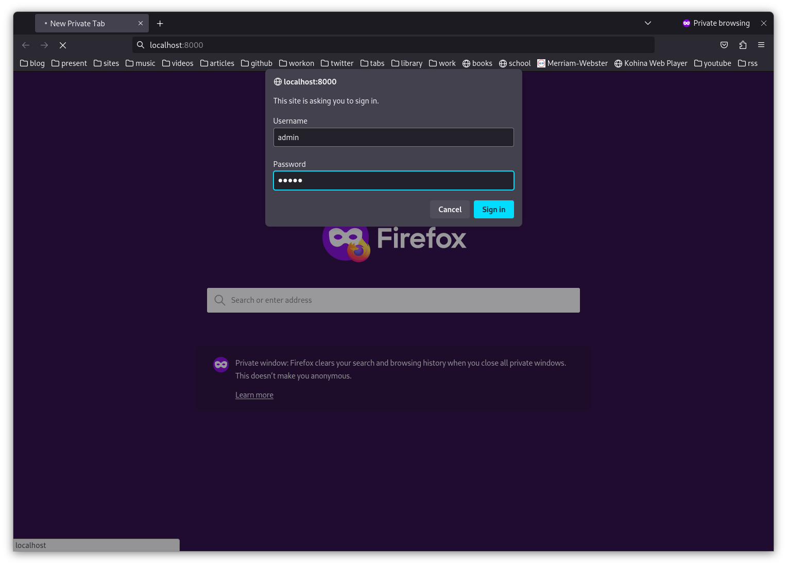

# Pure ChatRoom

This is a simple chat application built using PHP, HTML, and CSS. It allows users to chat with each other in real-time. Here's a guide to help you understand the structure and functionality of the application.

## Features
- User registration and login
- Real-time messaging
- Chat history
- User profile management

## Requirements
- Web server (e.g., Apache, Nginx)
- PHP 7.0 or higher
- SQLite3 database

## Folder Structure
The folder structure of the application is as follows:
```
├── chat.php
├── chatroom.db
├── database.php
├── images
│   ├── screenshot1.png
│   ├── screenshot2.png
│   └── send-1024.png
├── index.php
└── static
    └── stylesheet.css
```

## Site UI
The Site UI of the application is as follows:




## Contributing

Contributions to this project are welcome! If you find any issues or want to enhance the application, feel free to create a pull request.

## Contact

If you have any questions or suggestions, you can reach out to the project maintainer at [jeffkeras@gmail.com](mailto:jeffkeras@gmail.com)

Happy chatting!


